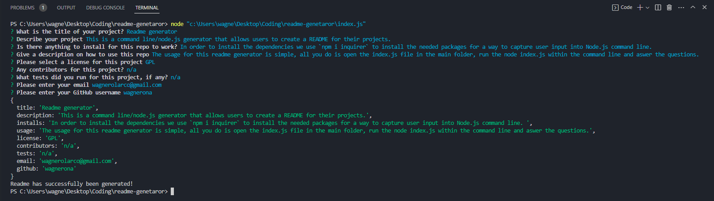
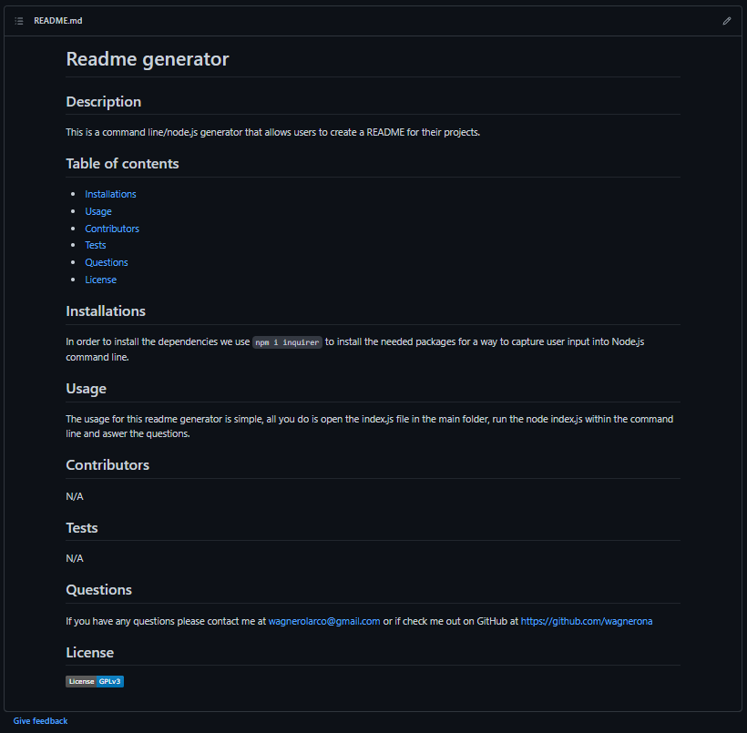

# Week 11 challenge: Readme generator

## Description

My task for this weeks challenge was to create a command-line application that dynamically generates a professional README.md file from a user's input using the Inquirer package. This should include what the app is for, how to use the app, how to install it, how to report issues, and how to make contributions—this last part increases the likelihood that other developers will contribute to the success of the project.

## Table of contents

- [User Story](#user-story)
- [Acceptance criteria](#acceptance-criteria)
- [Preview](#preview)
- [Walkthrough Video](#walkthrough-video)
- [Usage](#usage)
- [Improvements](#improvements)
- [Questions](#questions)
- [License](#license)

## User Story

- As a developer, I want a README generator so that I can quickly create a professional README for a new project

## Acceptance Criteria

- Create a command-line application that accepts user input.
  - When a user is prompted for information about the application repository then a high-quality, professional README.md is generated with:
    - The title of my project
    - Sections entitled:
      - Description
      - Table of Contents
      - Installation
      - Usage
      - License
      - Contributing
      - Tests
      - Questions
    - When a user enters the project title then it is displayed as the title of the README
    - When a user enters a description, installation instructions, usage information, contribution guidelines, and test instructions then this information is added to the sections of the README entitled Description, Installation, Usage, Contributing, and Tests
    - When a user chooses a license for their application from a list of options then a badge for that license is added near the top of the README and a notice is added to the section of the README entitled **License** that explains which license the application is covered under
    - When a user enters their GitHub username then this is added to the section of the README entitled Questions, with a link to their GitHub profile
    - When a user enters their email address then this is added to the section of the README entitled Questions, with instructions on how to reach them with additional questions
    - When a user clicks on the links in the **Table of Contents** then they are taken to the corresponding section of the README

## Preview

  
  

## Walkthrough video

https://drive.google.com/file/d/1s-goFoClp2qvYeaq0V8CGuPVq8rv32KP/view?usp=sharing
  
## Usage

The usage for this readme generator is simple, all you do is open the index.js file in the main folder, run the node index.js within the command line and answer the questions.

## Improvements

- I haven't yet figured out how to include images as a part of the input, for mockup section
- I have to add a section to create a table of contents with lists and their links to the headers
- Need to add validation checks for emails and blank inputs

## Questions

If you have any questions please contact me at wagnerolarco@gmail.com or check me out on GitHub at https://github.com/wagnerona

## License

Please refer to the MIT license if you are using any information provided in this repo. Copyright (c) 2023 wagnerona

